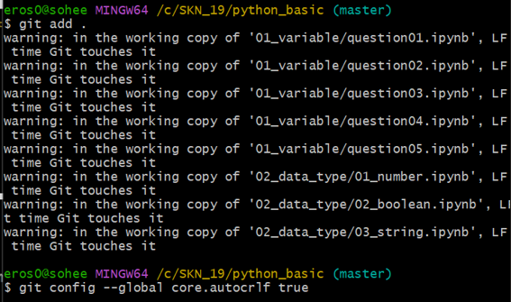

<div align="center"><h2>🧐 상황별 Git 명령어</h2></div><br>

- [git 최초 연동 후 작업할 때](상황별깃명령어/원격저장소연결하기.md)
- [git 클론 후 작업할 때](상황별깃명령어/원격저장소연결하기.md)
- [브랜치 생성하고 개발하고 커밋하고 푸쉬하고 PR 요청하고 브랜치 삭제까지](상황별깃명령어/자주사용하는명령어.md)

<br>

<div align="center"><h2>🧐 깃허브로 협업하기</h2></div><br>

- [깃허브 프로젝트 관리](깃허브기능/깃허브프로젝트관리기능.md)

<br><br><br><br>

## **브랜치랑 관련된**
#### 새로운 브랜치 생성할 때

```bash
$ git checkout -b 브랜치명   
$ git push --set-upstream origin 브랜치명
$ git push origin 브랜치명
```

#### 브랜치 확인 방법

```bash
$ git branch        # 현재 위치한 브랜치 확인
$ git branch -a     # 브랜치 목록 확인
$ git branch -r     # 원격 브랜치 목록 확인
```

#### 브랜치 삭제할 때

```bash
$ git branch -d 브랜치명        # 로컬 브랜치 삭제
$ git push origin -d 브랜치명   # 원격 브랜치 삭제
```

#### 삭제한 브랜치 복구할 때

```bash
$ git reflog                            # 삭제한 브랜치와 커밋 해시값 확인
$ git checkout -b 삭제한브랜치명 해시값
```

## **기타 작업**
#### 시점 되돌릴 때
- 커밋 후 작업 되돌리고 싶을 때

```bash
$ git revert hash값     # hash값: 되돌리고 싶은 시점 값
```

#### 경고 메세지 
- 줄바꿈(LF vs CRLF) 문제로 인한 Git 경고 메세지 나올 때

<p align="left">
  
</p>

```bash
$ git config --global core.autocrlf true
```

#### 깃허브에서 pull request 후 병합할 때
[충동발생시](https://chaeyoung2.tistory.com/61)

#### 이슈 사용법

[이슈사용법](https://velog.io/@dohaeng0/GitHub-Project-Issue-%ED%99%9C%EC%9A%A9)


