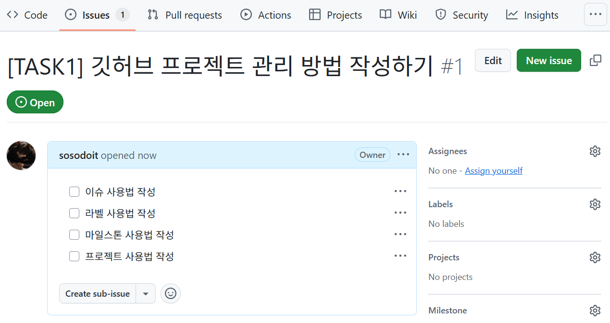

## 깃허브 프로젝트 관리

1. Issue : 작업 단계별 업무와 서브업무를 관리
2. Label : Issue에 Label을 추가하여 Issue를 카테고리별로 관리
2. Milestone : Issues를 그룹핑하여 전체적인 진행상황 추적
4. Project : Issue를 진행상태에 따라 구분하여 프로젝트 관리

## Issue

- 작업 단계별 업무정의
- 체크리스트 작성
- 커밋할때 끝부분에 Issue 태그를 붙이면, 자동으로 커밋이 해당 Issue로 분류
