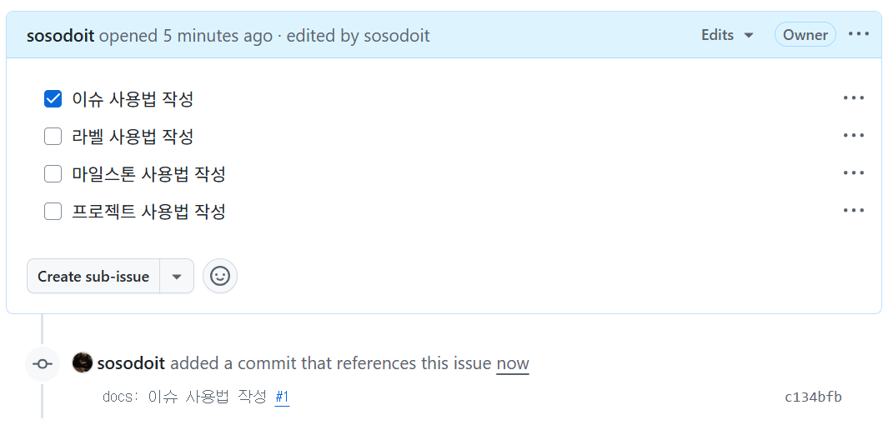
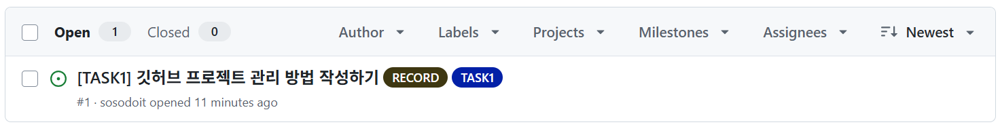
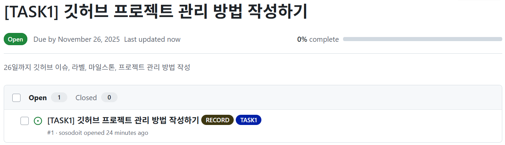

# 깃허브 프로젝트 관리

- [Issues](#Issues) : 작업 단계별 업무와 서브업무 작성
- [Labels](#Labels) : 태그 느낌, 이슈 구분
- [Milestones](#Milestones) : 개발 목표일(마감일) 지정
- [Projects](#Projects) : 전반적인 진행 현황 관리

<br>

## Issues
> 
> - 제목: 작업 단계별 업무정의
> - 내용: 체크리스트 작성

<br>

> 
> - 커밋할때 끝부분에 Issue 태그를 붙이면, 자동으로 커밋이 해당 Issue로 분류
> - ```git commit -m "docs: 이슈 사용법 작성 #1"```

<br><br>

## Labels
> 
> - 작업단계 `TASK1`의 유형은 `RECORD`
> - 협업 하면서 이슈가 많아졌을 때, 어떤 작업단계에 대한 이슈이고, 이슈 유형을 구분

<br><br>

## Milestones
> 
> - 작업 단계별 목표일을 설정하여 해당 작업에 속하는 이슈 관리 

<br><br>

## Projects
> 
> - 프로젝트 추가시 Basic Kanban 템플릿 생성 및 Issue 연결
> - 전반적인 작업 진척도 체킹
